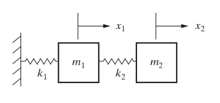

2DOF Systems
============

The 2DOF (Two Degree of Freedom) systems module in nphmu_vmd allows for the analysis of systems with two or more degrees of freedom. 
This section provides a guide on using the MDOF systems module, including quick examples and detailed tutorials.

Quick Examples
--------------

To get a feel for how the 2DOF systems module works, here are a few quick examples.

Example 1: Basic Usage
^^^^^^^^^^^^^^^^^^^^^^

Import the basic sdof module and numpy and plotting capabilities

.. code-block:: python

    import numpy as np
    import matplotlib.pyplot as plt
    from np_vmd.tdof_MCK import TDOF_modal

Define a system 2DOF system with

..   :height: [optional height]
..   :width: [optional width]

- m1 = 9 and m2=1 kg
- c1 = 2.4 and c=0.3 kg/s
- k1 = 24 and k2=3 N/m

The equation of motion in matrix form is:

.. math:: 

    \mathbf{M_{mat}}\ddot{\mathbf{x}} + \mathbf{C_{mat}}\dot{\mathbf{x}} + \mathbf{K_{mat}}\mathbf{x} = \mathbf{F}

.. math:: 

    \begin{bmatrix} m_1 & 0 \\ 0 & m_2\end{bmatrix}            \cdot \begin{bmatrix}\ddot{x_1} \\ \ddot{x_2} \end{bmatrix} + 
    \begin{bmatrix} c_1 +c_2 & -c_2 \\ -c_2 & c_2\end{bmatrix} \cdot \begin{bmatrix}\dot{x_1}  \\ \dot{x_2}  \end{bmatrix} +
    \begin{bmatrix} c_1+c_2 & -k_2 \\ -k_2 & k_2\end{bmatrix}  \cdot \begin{bmatrix} x_1        \\ x_2       \end{bmatrix} =0 
     

The connection between the elements determines:
 
- Mmat: Inertial matrix
- Cmat: Damping matrix 
- Kmat: Stiffness matrix

.. code-block:: 
    
    m1,m2  = 9,1
    k1=24
    k2=3
    c1 = 2.4
    c2 = 0.3
    # definition of system matrices. 
    Mmat = np.array([[m1,0],[0,m2]])
    Kmat = np.array([[k1+k2,-k2],[-k2,k2]])
    Cmat =  np.array([[c1+c2,-c2],[-c2,c2]])
    # system definition
    tmck = TDOF_modal(Mmat, K=Kmat, C=Cmat) 

Next is the initial excitation and the initial values. In this example wi are setting:

- x1 = 1 and x2 = 0  (initial displacement only for mass 1) 
- x'1=0 and x'2 = 0 (initial velocity is 0)

.. code-block:: python
    
    tmck.set_iv(x0s = np.array([[1, 0]]).T, dx0s = np.array([[0,0]]).T)

It possible to obtain the intermediate uncoupled matrices (optional) and other relevant values

.. code-block:: 
    
    print(f"K-tilde:\n {tmck.Ktilde}")
    print(f"zs     : {tmck.zs}")
    tmck.update_damping( np.array([0.1, 0.05]))
    print(f"zs     : {tmck.zs}")
    print(f"wns     : {tmck.wns}")

Example 2: calculate the Free Response
^^^^^^^^^^^^^^^^^^^^^^^^^^^^^^^^^^^^^^

Continuing from above:

- define a time vector t  
- obtain the free response (displacement) 
- plot the free response
- plot the velocity respone:

.. code-block:: python

    ts = np.linspace(0, 50, 1000) # time vector
    xs = tmck.calc_x_hom_response(ts) # positions

    fig, axs = plt.subplots(2,1, sharex=True, sharey=True)
    axs[0].plot(ts, xs[0,:], label = 'x_1')
    axs[1].plot(ts, xs[1,:], label = 'x_2')
    axs[0].legend()
    axs[1].legend()
    plt.xlabel('time [s]')
    axs[0].set_ylabel('$x_1$')
    axs[1].set_ylabel('$x_2$')
    plt.show()

Detailed Tutorials (WIP)
------------------------

Here we walk through detailed examples of common analyses you can perform with the SDOF module.

Example 1: Detailed Analysis of an 2DOF System
^^^^^^^^^^^^^^^^^^^^^^^^^^^^^^^^^^^^^^^^^^^^^^

.. code-block:: python

    # Detailed tutorial content

